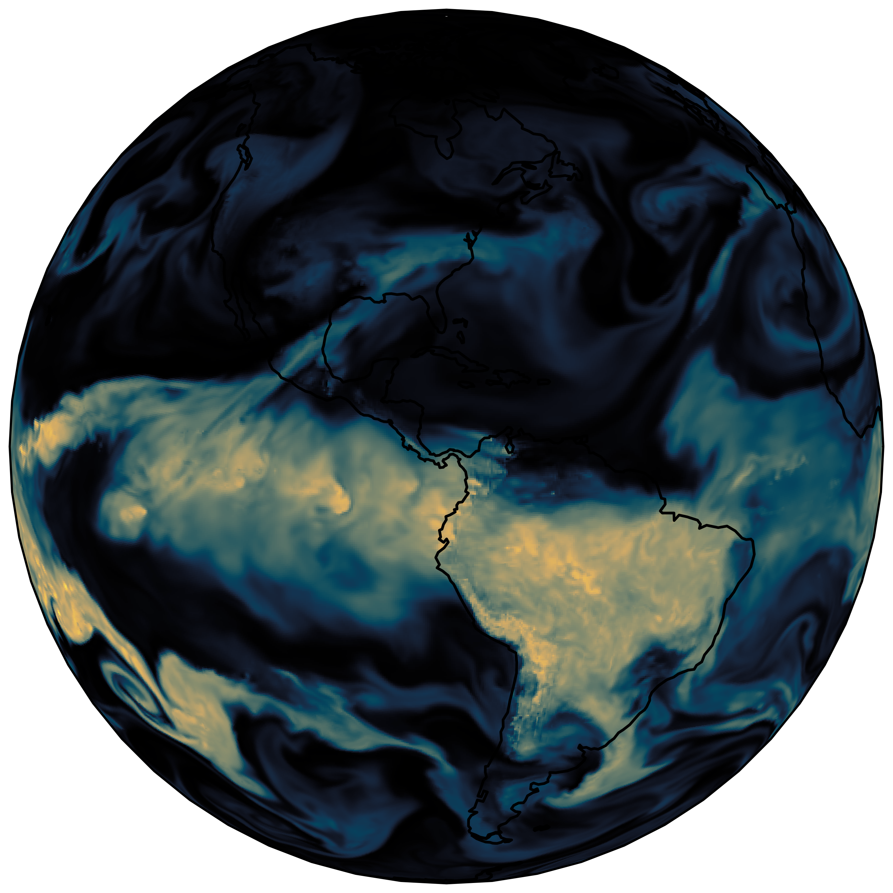
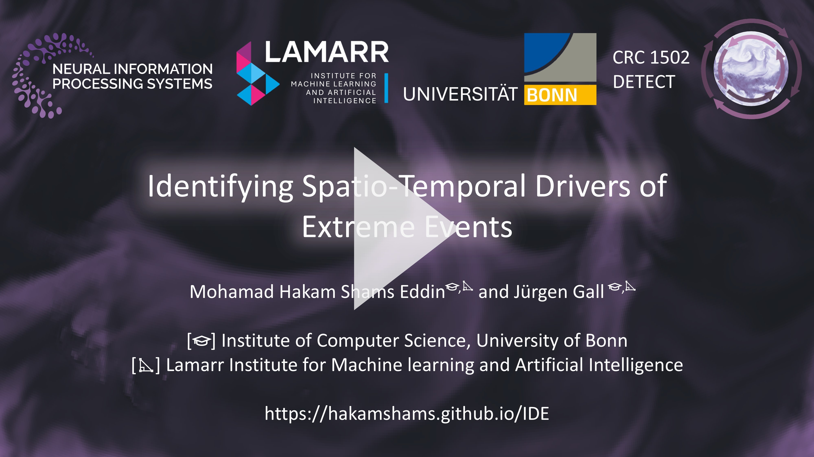

[](https://hakamshams.github.io/IDE/)
[]()
[](https://arxiv.org/abs/2410.24075)


 
# Identifying Spatio-Temporal Drivers of Extreme Event (IDEE)

Computer Vision Group, Institute of Computer Science III, University of Bonn.

This is the code to reproduce the results presented in the paper:
["**Identifying Spatio-Temporal Drivers of Extreme Events**"](https://arxiv.org/abs/2410.24075) by [Mohamad Hakam Shams Eddin](https://hakamshams.github.io/), and [Juergen Gall](http://pages.iai.uni-bonn.de/gall_juergen/). Accepted at [NeurIPS'24](https://neurips.cc/Conferences/2024).
### [Website](https://hakamshams.github.io/IDE/) | Paper

[]()

<br />

The spatio-temporal relations of extreme events impacts and their drivers in climate data are not fully understood and there is a need of machine learning approaches to identify such spatio-temporal relations from data. 
The task, however, is very challenging since there are time delays between extremes and their drivers, and the spatial response of such drivers is inhomogeneous. 
In this work, we propose a first approach and benchmarks to tackle this challenge. 
Our approach is trained end-to-end to predict spatio-temporally extremes and spatio-temporally drivers in the physical input variables jointly. 
We assume that there exist precursor drivers, primarily as anomalies in assimilated land surface and atmospheric data, for every observable impact of extremes. 
By enforcing the network to predict extremes from spatio-temporal binary masks of identified drivers, the network successfully identifies drivers that are correlated with extremes. 
We evaluate our approach on three newly created synthetic benchmarks where two of them are based on remote sensing or reanalysis climate data and on two real-world reanalysis datasets. 

## Poster

<table><tr><td>
  
</td></tr></table>

## Setup

....

## Code

The code has been tested under Pytorch 1.12.1 and Python 3.10.6 on Ubuntu 20.04.5 LTS with NVIDIA A100 & A40 GPUs and GeForce RTX 3090 GPU.

### Configuration

The main config file [config.py](config.py) includes the parameters for training and testing and models.

To train on the synthetic data:
```
  train_synthetic.py
```
For testing on the synthetic data:
```
  test_synthetic.py
```
Similarly, to train on the real-world data i.e., ERA5 Land:
```
  train_ERA5_Land.py
```
and for testing on ERA5 Land:
```
  test_ERA5_Land.py
```

The code is implemented with a simple DataParallel for multi-GPUs.
Training on real-world different than the one in the paper, requires fine-tuning for the hyper-parameters and weighting.

### Backbones
- [x] [Video Swin Transformer](models/encoder/Swin_3D.py)
- [x] [Vision Mamba](models/encoder/Mamba.py)
- [x] [3D CNN](models/encoder/CNN_3D.py)

### Baselines

- [Multiple instance learning](Baselines_MIL):
  - [x] DeepMIL
  - [x] ARNet
  - [x] RTFM
  - [ ] MGFN
- [One Class](Baselines_OneClass):
  - [x] SimpleNet
- [Reconstruction based](Baselines_Reconstruction):
  - [x] UniAD
  - [x] STEALNET

### Pretrained models

...

### Structure
```
├── Baselines_MIL
│   ├── config.py
│   ├── dataset
│   │   └── Synthetic_dataset.py
│   ├── log
│   ├── models
│   │   ├── agent
│   │   │   └── Swin_3D.py
│   │   ├── build_arnet.py
│   │   ├── build_deepmil.py
│   │   ├── build_mgfn.py
│   │   ├── build_rtfm.py
│   │   ├── classifier
│   │   │   ├── ARNet.py
│   │   │   ├── DeepMIL.py
│   │   │   ├── MGFN.py
│   │   │   └── RTFM.py
│   │   ├── encoder
│   │   │   ├── CNN_3D.py
│   │   │   ├── Mamba.py
│   │   │   └── Swin_3D.py
│   │   └── losses.py
│   ├── test_mil_synthetic.py
│   ├── train_arnet_synthetic.py
│   ├── train_deepmil_synthetic.py
│   ├── train_mgfn_synthetic.py
│   ├── train_rtfm_synthetic.py
│   └── utils
│       └── utils_train.py
├── Baselines_OneClass
│   ├── config.py
│   ├── dataset
│   │   └── Synthetic_dataset.py
│   ├── log
│   ├── models
│   │   ├── build_simplenet.py
│   │   ├── encoder
│   │   │   ├── CNN_3D.py
│   │   │   ├── Mamba.py
│   │   │   └── Swin_3D.py
│   │   └── losses.py
│   ├── test_simplenet_synthetic.py
│   ├── train_simplenet_synthetic.py
│   └── utils
│       └── utils_train.py
├── Baselines_Reconstruction
│   ├── config.py
│   ├── dataset
│   │   └── Synthetic_dataset.py
│   ├── log
│   ├── models
│   │   ├── build_steal.py
│   │   ├── build_uniad.py
│   │   ├── initializer.py
│   │   └── losses.py
│   ├── test_steal_synthetic.py
│   ├── test_uniad_synthetic.py
│   ├── train_steal_synthetic.py
│   ├── train_uniad_synthetic.py
│   └── utils
│       └── utils_train.py
├── config.py
├── dataset
│   ├── CERRA_dataset.py
│   ├── ERA5_Land_dataset.py
│   └── Synthetic_dataset.py
├── docs
│   ├── images
│   │   ├── era5.png
│   │   ├── NeurIPS-logo.svg
│   │   ├── neurips-navbar-logo.svg
│   │   └── video_cover_ide.jpg
│   └── poster
│       └── Shams_Gall.png
├── log
├── models
│   ├── build.py
│   ├── classifier
│   │   └── CNN_3D.py
│   ├── codebook
│   │   ├── FSQ.py
│   │   ├── LatentQuantize.py
│   │   ├── LFQ.py
│   │   ├── Random_VQ.py
│   │   └── VQ.py
│   ├── encoder
│   │   ├── CNN_3D.py
│   │   ├── Mamba.py
│   │   └── Swin_3D.py
│   └── losses.py
├── README.md
├── scripts
│   ├── download_cerra.sh
│   ├── download_era5_land.sh
│   ├── download_noaa_cerra.sh
│   ├── download_noaa_era5_land.sh
│   └── download_synthetic.sh
├── test_CERRA.py
├── test_ERA5_Land.py
├── test_synthetic.py
├── train_CERRA.py
├── train_ERA5_Land.py
├── train_synthetic.py
├── utils
│   └── utils_train.py
└── vis
    ├── visualize_CERRA_data.py
    ├── visualize_ERA5-Land_data.py
    ├── visualize_NOAA_data.py
    └── visualize_synthetic_data.py
```

## Dataset

- The full data set can be obtained from [https://doi.org/10.60507/FK2/RD9E33](https://doi.org/10.60507/FK2/RD9E33) (~ 1.1 TB after decompression).
- The data can be also downloaded via scripts found in [scripts](scripts) i.e., you can download the synthetic data via [script/download_synthetic.sh](scripts/download_synthetic.sh) (~46 GB):
  ```
   wget --continue  https://bonndata.uni-bonn.de/api/access/datafile/7506 -O Synthetic.7z
  ```
  To extract the files you need the 7-Zip packge:
  ```
   sudo apt update
   sudo apt install p7zip-full
  ```
  and to extract:
  ```
   7za x Synthetic.7z
  ```
  
  CERRA files are large, so they are split into two files. To extract CERRA files just run:
  ```
   7za x CERRA.7z.001
  ```
  7z will find CERRA.7z.002 automatically.

- You can visualize the data using the scripts in [vis](vis).

### Citation
If you find our work useful, please cite:

```

To appear on Openreview ...

```

### Acknowledgments


This work was funded by the Deutsche Forschungsgemeinschaft (DFG, German Research Foundation) within the Collaborative Research Centre SFB 1502/1–2022 - [DETECT](https://sfb1502.de/) - [D05](https://sfb1502.de/projects/cluster-d/d05) and by the Federal Ministry of Education and Research (BMBF) under grant no. 01IS24075C RAINA.

### License

The code is released under MIT License. See the [LICENSE](LICENSE) file for details.
